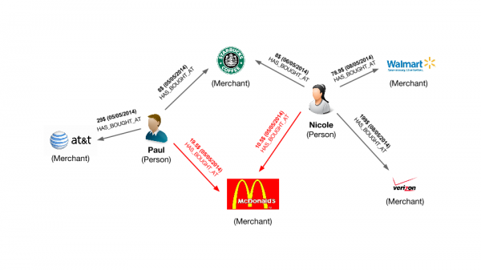

# Credit Card Fraud Detection

Banks, merchants and credit card processors companies lose billions of dollars every year to credit card fraud. Credit card data can be stolen by criminals but sometimes the criminal is simply the clerk that processes your card when you buy things.

Graph databases can help find credit card thieves faster. By representing transactions as a graph, we can look for the common denominator in the fraud cases and find the point of origin of the scam.

A series of credit card transactions can be represented as a graph. Each transaction involves two nodes : a person (the customer) and a merchant. The nodes are linked by the transaction itself. A transaction has a date and a status.

Legitimate transactions have the status "Undisputed". Fraudulent transactions are "Disputed".

The graph data model below represents how the data looks as a graph.



## Sample Dataset


### Create Customers

```
let cust = [
    {"_key":"Marc","age":30,"gender":"man","name":"Marc"},
    {"_key":"Zoey","age":52,"gender":"woman","name":"Zoey"},
    {"_key":"Dan","age":23,"gender":"man","name":"Dan"},
    {"_key":"Jean","age":48,"gender":"man","name":"Jean"},
    {"_key":"Ava","age":23,"gender":"woman","name":"Ava"},
    {"_key":"Madison","age":37,"gender":"woman","name":"Madison"},
    {"_key":"Mia","age":51,"gender":"woman","name":"Mia"},
    {"_key":"Paul","age":50,"gender":"man","name":"Paul"},
    {"_key":"Olivia","age":58,"gender":"woman","name":"Olivia"},
    {"_key":"John","age":31,"gender":"man","name":"John"}
]

for customer in cust 
    insert customer in customers

```
### Create Merchants

```
LET m = [
	{"_key": "Amazon", "name": "Amazon", "street": "2626 Wilkinson Court", "address":"San Bernardino, CA 92410"},
	{"_key": "Abercrombie", "name": "Abercrombie", "street": "4355 Walnut Street", "address":"San Bernardino, CA 92410"},
	{"_key": "Walmart", "name": "Walmart", "street": "2092 Larry Street", "address":"San Bernardino, CA 92410"},
	{"_key": "McDonalds", "name": "McDonalds", "street": "1870 Caynor Circle", "address":"San Bernardino, CA 92410"},
	{"_key": "American_Apparel", "name": "American_Apparel", "street": "1381 Spruce Drive", "address":"San Bernardino, CA 92410"},
	{"_key": "Just_Brew_It", "name": "Just_Brew_It", "street": "826 Anmoore Road", "address":"San Bernardino, CA 92410"},
	{"_key": "Justice", "name": "Justice", "street": "1925 Spring Street", "address":"San Bernardino, CA 92410"},
	{"_key": "Sears", "name": "Sears", "street": "4209 Elsie Drive", "address":"San Bernardino, CA 92410"},
	{"_key": "Soccer_for_the_City", "name": "Soccer for the City", "street": "86 D Street", "address":"San Bernardino, CA 92410"},
	{"_key": "Sprint", "name": "Sprint", "street": "945 Kinney Street", "address":"San Bernardino, CA 92410"},
	{"_key": "Starbucks", "name": "Starbucks", "street": "3810 Apple Lane", "address":"San Bernardino, CA 92410"},
	{"_key": "Subway", "name": "Subway", "street": "3778 Tenmile Road", "address":"San Bernardino, CA 92410"},
	{"_key": "Apple_Store", "name": "Apple Store", "street": "349 Bel Meadow Drive", "address":"Kansas City, MO 64105"},
	{"_key": "Urban_Outfitters", "name": "Urban Outfitters", "street": "99 Strother Street", "address":"Kansas City, MO 64105"},
	{"_key": "RadioShack", "name": "RadioShack", "street": "3306 Douglas Dairy Road", "address":"Kansas City, MO 64105"},
	{"_key": "Macys", "name": "Macys", "street": "2912 Nutter Street", "address":"Kansas City, MO 64105"}
]
FOR merchant IN m
	insert merchant in merchants
  
```

### Create Transactions (Edges)

```
LET e = [
	{"_from": "customers/Paul", "_to": "merchants/Just_Brew_It", "amount": 986, "status": "Undisputed", "time":"4/17/2014"},
	{"_from": "customers/Paul", "_to": "merchants/Starbucks", "amount": 239, "status": "Undisputed", "time":"5/15/2014"},
	{"_from": "customers/Paul", "_to": "merchants/Sears", "amount": 475, "status": "Undisputed", "time":"3/28/2014"},
	{"_from": "customers/Paul", "_to": "merchants/Walmart", "amount": 654, "status": "Undisputed", "time":"3/20/2014"},
	{"_from": "customers/Jean", "_to": "merchants/Soccer_for_the_City", "amount": 196, "status": "Undisputed", "time":"7/24/2014"},
	{"_from": "customers/Jean", "_to": "merchants/Abercrombie", "amount": 502, "status": "Undisputed", "time":"4/9/2014"},
	{"_from": "customers/Jean", "_to": "merchants/Walmart", "amount": 848, "status": "Undisputed", "time":"5/29/2014"},
	{"_from": "customers/Jean", "_to": "merchants/Amazon", "amount": 802, "status": "Undisputed", "time":"3/11/2014"},
	{"_from": "customers/Jean", "_to": "merchants/Subway", "amount": 203, "status": "Undisputed", "time":"3/27/2014"},
	{"_from": "customers/Dan", "_to": "merchants/McDonalds", "amount": 35, "status": "Undisputed", "time":"1/23/2014"},
	{"_from": "customers/Dan", "_to": "merchants/McDonalds", "amount": 605, "status": "Undisputed", "time":"1/27/2014"},
	{"_from": "customers/Dan", "_to": "merchants/Soccer_for_the_City", "amount": 62, "status": "Undisputed", "time":"9/17/2014"},
	{"_from": "customers/Dan", "_to": "merchants/Amazon", "amount": 141, "status": "Undisputed", "time":"11/14/2014"},
	{"_from": "customers/Marc", "_to": "merchants/Amazon", "amount": 134, "status": "Undisputed", "time":"4/14/2014"},
	{"_from": "customers/Marc", "_to": "merchants/American_Apparel", "amount": 336, "status": "Undisputed", "time":"4/3/2014"},
	{"_from": "customers/Marc", "_to": "merchants/Walmart", "amount": 964, "status": "Undisputed", "time":"3/22/2014"},
	{"_from": "customers/Marc", "_to": "merchants/Sears", "amount": 430, "status": "Undisputed", "time":"8/10/2014"},
	{"_from": "customers/Marc", "_to": "merchants/Soccer_for_the_City", "amount": 11, "status": "Undisputed", "time":"9/4/2014"},
	{"_from": "customers/John", "_to": "merchants/Soccer_for_the_City", "amount": 545, "status": "Undisputed", "time":"10/6/2014"},
	{"_from": "customers/John", "_to": "merchants/Sprint", "amount": 457, "status": "Undisputed", "time":"10/15/2014"},
	{"_from": "customers/John", "_to": "merchants/Justice", "amount": 468, "status": "Undisputed", "time":"7/29/2014"},
	{"_from": "customers/John", "_to": "merchants/American_Apparel", "amount": 768, "status": "Undisputed", "time":"11/28/2014"},
	{"_from": "customers/John", "_to": "merchants/Just_Brew_It", "amount": 921, "status": "Undisputed", "time":"3/12/2014"},
	{"_from": "customers/Zoey", "_to": "merchants/McDonalds", "amount": 740, "status": "Undisputed", "time":"12/15/2014"},
	{"_from": "customers/Zoey", "_to": "merchants/Abercrombie", "amount": 510, "status": "Undisputed", "time":"11/27/2014"},
	{"_from": "customers/Zoey", "_to": "merchants/Just_Brew_It", "amount": 414, "status": "Undisputed", "time":"1/20/2014"},
	{"_from": "customers/Zoey", "_to": "merchants/Amazon", "amount": 721, "status": "Undisputed", "time":"7/17/2014"},
	{"_from": "customers/Zoey", "_to": "merchants/Subway", "amount": 353, "status": "Undisputed", "time":"10/25/2014"},
	{"_from": "customers/Ava", "_to": "merchants/Sears", "amount": 681, "status": "Undisputed", "time":"12/28/2014"},
	{"_from": "customers/Ava", "_to": "merchants/Walmart", "amount": 87, "status": "Undisputed", "time":"2/19/2014"},
	{"_from": "customers/Ava", "_to": "merchants/American_Apparel", "amount": 533, "status": "Undisputed", "time":"8/6/2014"},
	{"_from": "customers/Ava", "_to": "merchants/American_Apparel", "amount": 723, "status": "Undisputed", "time":"1/8/2014"},
	{"_from": "customers/Ava", "_to": "merchants/Just_Brew_It", "amount": 627, "status": "Undisputed", "time":"5/20/2014"},
	{"_from": "customers/Olivia", "_to": "merchants/Soccer_for_the_City", "amount": 75, "status": "Undisputed", "time":"9/4/2014"},
	{"_from": "customers/Olivia", "_to": "merchants/Walmart", "amount": 231, "status": "Undisputed", "time":"7/12/2014"},
	{"_from": "customers/Olivia", "_to": "merchants/Soccer_for_the_City", "amount": 924, "status": "Undisputed", "time":"10/4/2014"},
	{"_from": "customers/Olivia", "_to": "merchants/Just_Brew_It", "amount": 742, "status": "Undisputed", "time":"8/12/2014"},
	{"_from": "customers/Mia", "_to": "merchants/Soccer_for_the_City", "amount": 276, "status": "Undisputed", "time":"12/24/2014"},
	{"_from": "customers/Mia", "_to": "merchants/Starbucks", "amount": 66, "status": "Undisputed", "time":"4/16/2014"},
	{"_from": "customers/Mia", "_to": "merchants/McDonalds", "amount": 467, "status": "Undisputed", "time":"12/23/2014"},
	{"_from": "customers/Mia", "_to": "merchants/Sears", "amount": 830, "status": "Undisputed", "time":"3/13/2014"},
	{"_from": "customers/Mia", "_to": "merchants/Amazon", "amount": 240, "status": "Undisputed", "time":"7/09/2014"},
	{"_from": "customers/Mia", "_to": "merchants/Soccer_for_the_City", "amount": 164, "status": "Undisputed", "time":"12/26/2014"},
	{"_from": "customers/Madison", "_to": "merchants/McDonalds", "amount": 630, "status": "Undisputed", "time":"10/6/2014"},
	{"_from": "customers/Madison", "_to": "merchants/Abercrombie", "amount": 19, "status": "Undisputed", "time":"7/29/2014"},
	{"_from": "customers/Madison", "_to": "merchants/Subway", "amount": 352, "status": "Undisputed", "time":"12/16/2014"},
	{"_from": "customers/Madison", "_to": "merchants/Amazon", "amount": 147, "status": "Undisputed", "time":"8/3/2014"},
	{"_from": "customers/Madison", "_to": "merchants/Walmart", "amount": 91, "status": "Undisputed", "time":"6/29/2014"},
	{"_from": "customers/Paul", "_to": "merchants/Apple_Store", "amount": 1021, "status": "Disputed", "time":"7/18/2014"},
	{"_from": "customers/Paul", "_to": "merchants/Urban_Outfitters", "amount": 1732, "status": "Disputed", "time":"5/10/2014"},
	{"_from": "customers/Paul", "_to": "merchants/RadioShack", "amount": 1415, "status": "Disputed", "time":"4/1/2014"},
	{"_from": "customers/Paul", "_to": "merchants/Macys", "amount": 1849, "status": "Disputed", "time":"12/20/2014"},
	{"_from": "customers/Marc", "_to": "merchants/Apple_Store", "amount": 1914, "status": "Disputed", "time":"7/18/2014"},
	{"_from": "customers/Marc", "_to": "merchants/Urban_Outfitters", "amount": 1424, "status": "Disputed", "time":"5/10/2014"},
	{"_from": "customers/Marc", "_to": "merchants/RadioShack", "amount": 1721, "status": "Disputed", "time":"4/1/2014"},
	{"_from": "customers/Marc", "_to": "merchants/Macys", "amount": 1003, "status": "Disputed", "time":"12/20/2014"},
	{"_from": "customers/Olivia", "_to": "merchants/Apple_Store", "amount": 1149, "status": "Disputed", "time":"7/18/2014"},
	{"_from": "customers/Olivia", "_to": "merchants/Urban_Outfitters", "amount": 1152, "status": "Disputed", "time":"5/10/2014"},
	{"_from": "customers/Olivia", "_to": "merchants/RadioShack", "amount": 1984, "status": "Disputed", "time":"4/1/2014"},
	{"_from": "customers/Olivia", "_to": "merchants/Macys", "amount": 1790, "status": "Disputed", "time":"12/20/2014"},
	{"_from": "customers/Madison", "_to": "merchants/Apple_Store", "amount": 1923, "status": "Disputed", "time":"7/18/2014"},
	{"_from": "customers/Madison", "_to": "merchants/Urban_Outfitters", "amount": 1375, "status": "Disputed", "time":"5/10/2014"},
	{"_from": "customers/Madison", "_to": "merchants/RadioShack", "amount": 1369, "status": "Disputed", "time":"4/1/2014"},
	{"_from": "customers/Madison", "_to": "merchants/Macys", "amount": 1816, "status": "Disputed", "time":"12/20/2014"}
]
FOR txn IN e
	INSERT txn IN txns
  
```

### Data Analysis

### Fraudulent Transactions

Identify all fraudulent transactions

```
FOR txn IN txns
    FILTER txn.status=="Disputed"
    RETURN txn
```

Alternate Query:
```
For txn in txns
    FILTER txn.status=="Disputed"
    FOR customer IN customers
        FILTER txn._from == customer._id
        FOR merchant IN merchants
            FILTER txn._to == merchant._id
            RETURN {customer: customer.name, merchant: merchant.name, txnID:txn._id, date: txn.time, amount: txn.amount}
	    
```

### Identify point of origin of the fraud

Now we know which customers and which merchants are involved in our fraud case. But **where is the criminal we are looking for?** What’s going to help use here is the transaction date on each fraudulent transaction.

The criminal we are looking for is involved in a legitimate transaction during which he captures his victims credit card numbers. After that, he can execute his illegitimate transactions. That means that we not only want the illegitimate transactions but also the transactions happening before the theft.

```
FOR x IN txns FILTER x.status == "Disputed"
  FOR y in txns FILTER y.status == "Undisputed"  
        FILTER y.time < x.time AND y._to != x._to AND y._from == x._from
    FOR customer in customers FILTER customer._id == y._from
    FOR merchant in merchants FILTER merchant._id == y._to
    SORT customer.name
    RETURN  {
        customer: customer.name, 
        merchant: merchant.name, 
        amount: y.amount, 
        date: y.time}
```

### Zero in on the criminal

Now we want to find the common denominator. Is there a common merchant in all of these seemingly innocuous transactions?

```
FOR x IN txns FILTER x.status == "Disputed"
  FOR y in txns FILTER y.status == "Undisputed"  
        FILTER y.time < x.time AND y._to != x._to AND y._from == x._from
    FOR customer in customers FILTER customer._id == y._from
    FOR merchant in merchants FILTER merchant._id == y._to
    SORT customer.name
    RETURN DISTINCT y
```

Each time a fraudulent transactions has occurred in the days leading to it, the credit card user has visited Wallmart. We know the place and the moment when the customers credit cards numbers were stolen. With C8DB graph visualization we could inspect the data to confirm our intuition. Now We can alert the authorities and the merchant on the situation. They should have enough information to do the rest!

## Links
* Fraud Data Generator -- https://github.com/metasyn/creditcardfrauddata
* Credit Card Fraud Detection --- https://gist.github.com/jvilledieu/3ad4cb2e3187ab21416b
